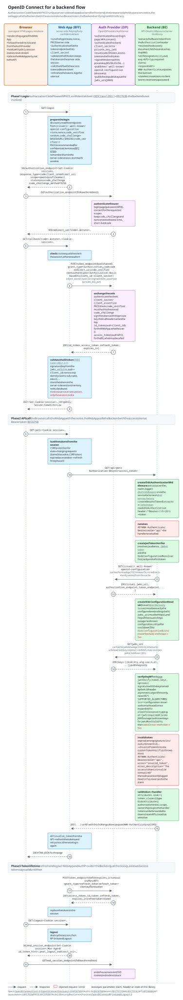

# Backend flow

A server-side web app (backend for frontend) is a confidential client: it runs the [Authorization Code Flow][1] itself, authenticates at the token endpoint with its client secret (or a private key) and keeps the tokens in a server-side session. The browser only holds the session cookie and never sees a token. The web app calls the backend with the access token as [bearer token][3], the backend (this library) verifies it against the auth provider's discovery document and JWKS.

The diagram has three phases:

 1. **Login:** the browser follows the redirects between the web app and the auth provider, the web app exchanges the code (with [PKCE][2] and client authentication) and starts the session. The backend is not involved.
 2. **API call:** the browser calls the web app with the cookie, the web app calls the backend with the access token, the backend extracts and verifies it and either calls the handler or responds with `401`. The notes name the parts of this library involved.
 3. **Token lifetime:** the web app refreshes the tokens and ends the session on logout. The backend just checks `exp`, an issued access token stays valid until then.

Open the diagram directly to follow the links within it.

[1]: https://openid.net/specs/openid-connect-core-1_0.html#CodeFlowAuth
[2]: https://www.rfc-editor.org/rfc/rfc7636
[3]: https://www.rfc-editor.org/rfc/rfc6750
