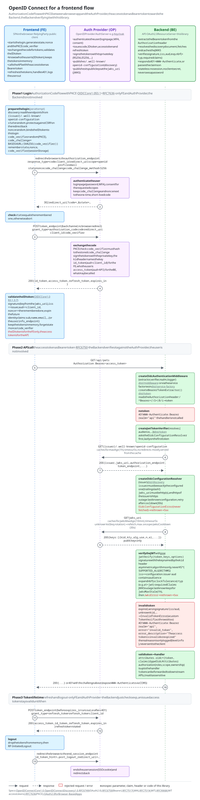

# Frontend flow

A browser app (single page application) is a public client: it cannot keep a secret, so it logs the user in at the auth provider with the [Authorization Code Flow][1] and [PKCE][2], validates the ID token itself and calls the backend with the access token as [bearer token][3]. The backend (this library) never sees the user, a password or a client secret, it only verifies the access token against the auth provider's discovery document and JWKS.

The diagram has three phases:

 1. **Login:** only the frontend and the auth provider are involved, the backend is not.
 2. **API call:** the frontend sends the access token, the backend extracts and verifies it and either calls the handler or responds with `401`. The notes name the parts of this library involved.
 3. **Token lifetime:** refresh and logout, again between frontend and auth provider. The backend just checks `exp`, an issued access token stays valid until then.

Open the diagram directly to follow the links within it.

[1]: https://openid.net/specs/openid-connect-core-1_0.html#CodeFlowAuth
[2]: https://www.rfc-editor.org/rfc/rfc7636
[3]: https://www.rfc-editor.org/rfc/rfc6750
