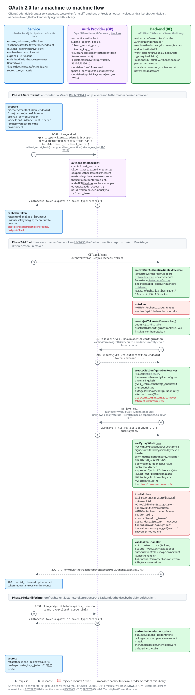

# Machine-to-machine flow

A service (another backend, a job, a pipeline) is a confidential client without a user: it gets an access token for itself through the [Client Credentials Grant][1] and calls the backend with it as [bearer token][2]. There is no login, no ID token and usually no refresh token. The backend (this library) verifies the token like any other, the claims identify the calling service instead of a user.

The diagram has three phases:

 1. **Get a token:** the service authenticates itself at the token endpoint and caches the access token until it expires.
 2. **API call:** the service sends the access token, the backend extracts and verifies it and either calls the handler or responds with `401`. The notes name the parts of this library involved.
 3. **Token lifetime:** a new token request before the token expires, and how the backend authorizes a client token by its claims.

Open the diagram directly to follow the links within it.

[1]: https://www.rfc-editor.org/rfc/rfc6749#section-4.4
[2]: https://www.rfc-editor.org/rfc/rfc6750
